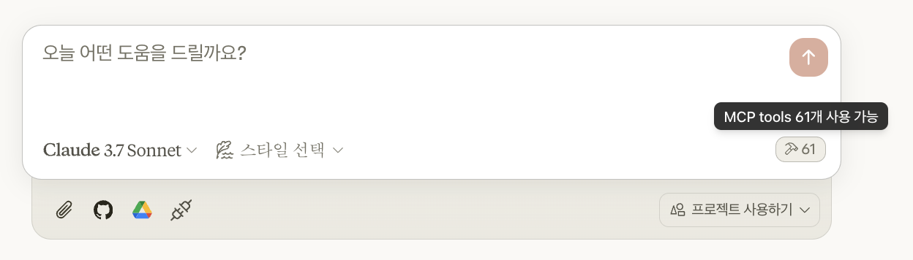
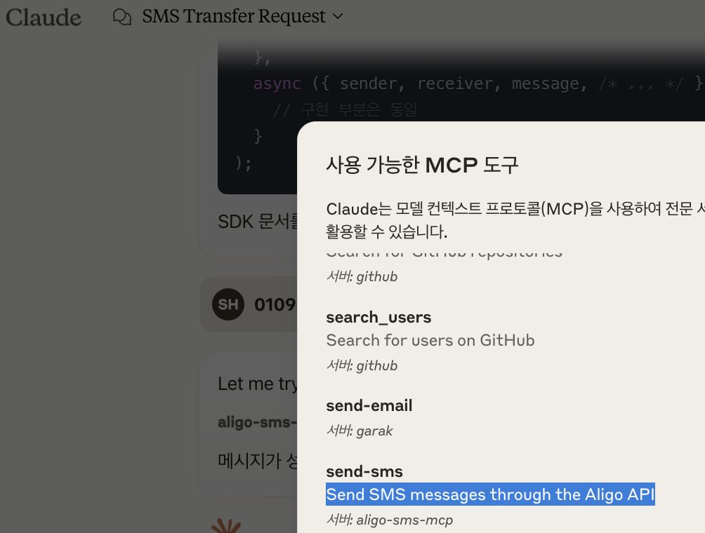
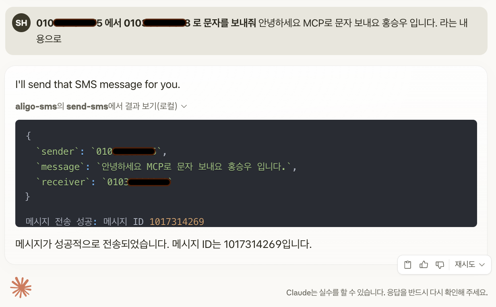

# Aligo SMS MCP 서버

Model Context Protocol(MCP)를 사용하여 Aligo SMS API에 접근할 수 있는 서버입니다. Claude AI와 같은 MCP 호환 AI 에이전트가 SMS 메시지를 보내거나 관련 정보를 조회할 수 있습니다.

## 설치

```json
{
  "mcpServers": {
    "aligo-sms-mcp": {
      "command": "npx",
      "args": [
        "-y",
        "github:hongsw/aligo-sms-mcp-server",
        "mcp-server"
      ]
    }
  }
}
```

## 설정

API 키 설정은 `.garakrc` 파일에 저장됩니다. 홈 디렉토리에 다음과 같은 파일을 만듭니다:

https://smartsms.aligo.in/admin/api/auth.html

```
ALIGO_API_KEY=발급받은_API_키
ALIGO_USER_ID=발급받은_사용자_아이디
ALIGO_TEST_MODE=Y  # 테스트 모드 (Y/N)
```

## 사용 방법

도구 목록 아이콘을 찾아서 누르면




위의 설정을 완료하면 다음과 같은 화면을 볼 수 있습니다.




```

010xxxxyyyy 에서 010xxxxyyyy 로 문자를 보내줘 "안녕하세요 MCP 22222입니다." 라는 내용으로

```
위의 프롬프트를 사용하여 보내면 




## Contributing

Contributions are welcome! Please feel free to submit a Pull Request.

## License

This project is licensed under the MIT License - see the LICENSE file for details.

## Acknowledgments

- Aligo for providing the SMS API
- Model Context Protocol for standardizing tool and resource access